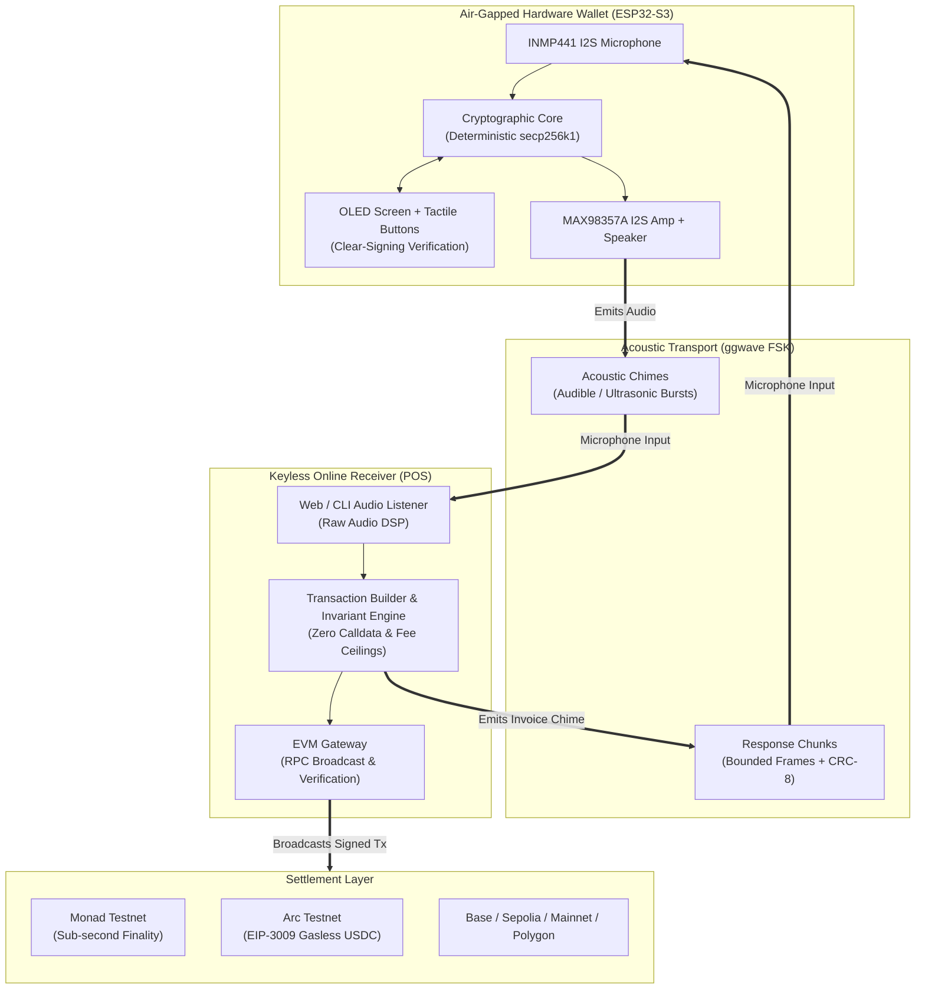
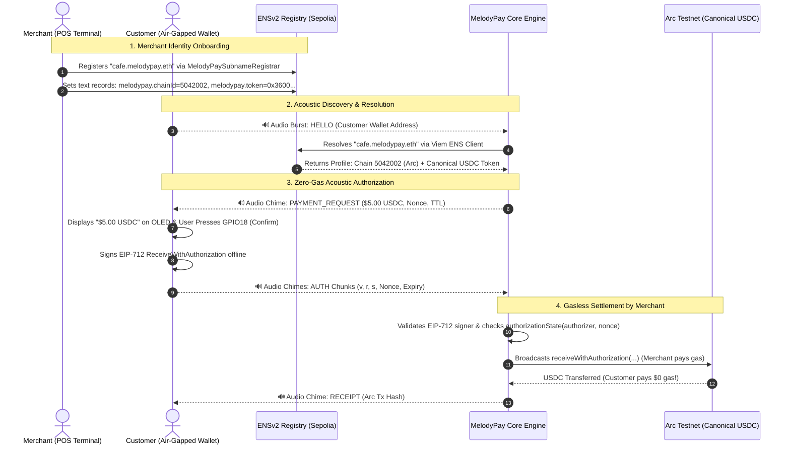
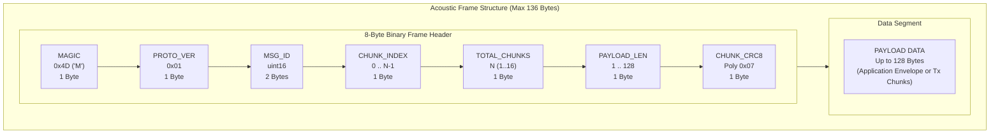
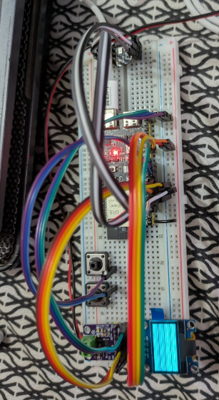

<p align="center">
  
</p>

<h1 align="center">MelodyPay</h1>

<p align="center">
  <strong>Air-gapped by sound. Sign offline. Settle on-chain.</strong>
</p>

<p align="center">
  <a href="tests/"></a>
  <a href="https://testnet.monadscan.com"></a>
  <a href="https://testnet.arcscan.app"></a>
  <a href="contracts/"></a>
  <a href="esp32/"></a>
</p>

<p align="center">
  <strong>Live Web Receiver & Demo:</strong> <a href="https://melody-pay.vercel.app">melody-pay.vercel.app</a>
</p>

---

## Executive Summary

MelodyPay eliminates the need for internet connectivity, Bluetooth, NFC, or USB connections on transaction-signing hardware. By utilizing [ggwave](https://github.com/ggerganov/ggwave) sound-wave data transport over standard acoustic frequencies (and ultrasound), signers can remain completely air-gapped while an online, keyless receiver handles blockchain interactions.

### System Architecture & Data Flow



---

## System Components & Workspaces

MelodyPay is structured as a multi-target monorepo:

| Component | Path | Language / Stack | Purpose |
|---|---|---|---|
| **Web Receiver & Studio** | [`receiver-web/`](receiver-web/) | React 18, Vite, TypeScript, Tailwind, Three.js, Framer Motion, Lenis | Keyless online receiver (`/receive`), interactive 3D hardware teardown (`/`), hardware pre-booking (`/register`), audio diagnostics (`/audio-test`), and visual receipts (`/receipt`). |
| **Hardware Wallet Firmware** | [`esp32/`](esp32/) | C, ESP-IDF 5.2+, FreeRTOS | Air-gapped firmware for ESP32-S3 with I2S audio drivers (INMP441 mic, MAX98357A amp), OLED screen support, tactile GPIO approval buttons, hardware framing, and local secp256k1 signing. |
| **Operator Terminal CLI** | [`cli/`](cli/) | Node.js, TypeScript, Ethers.js | Standalone terminal application for merchant POS or automated test runners without browser dependencies. Accepts raw transactions via audio, stdin, or serial. |
| **ENSv2 Smart Contracts** | [`contracts/`](contracts/) | Solidity 0.8.20, Foundry | Merchant subname registrar (`MelodyPaySubnameRegistrar.sol`) integrated with official ENSv2 protocols on Sepolia, enabling human-readable merchant routing (e.g., `cafe.melodypay.eth`). |
| **RPC Gateway API** | [`api/`](api/) | TypeScript, Vercel Serverless | Serverless proxy (`api/arc-rpc.ts`) bypassing browser CORS limitations for Arc testnet RPC interactions. |
| **Documentation & Specs** | [`docs/`](docs/) | Markdown, SVG | Detailed specifications for the binary acoustic protocol, hardware wiring diagrams, bill of materials, security models, and test logs. |

---

## Supported Chains & Settlement Models

MelodyPay includes preconfigured EVM chain profiles in [`receiver-web/src/core/chains.ts`](receiver-web/src/core/chains.ts) with strict gas ceilings and invariant checks:

| Network | Chain ID | Native Currency | Settlement Model | Characteristics |
|---|---|---|---|---|
| **Monad Testnet** | `10143` | `MON` | Native EIP-1559 Transfer | ~400ms block times, ~800ms finality. Strict 21,000 gas limit enforcement to align with Monad's charge-on-gas-limit rule. |
| **Arc Testnet** | `5042002` | `USDC` | Native Transfer & **EIP-3009 Gasless Authorization** | Native USDC gas token or gasless settlement via canonical USDC contract (`0x3600000000000000000000000000000000000000`) where receiver covers gas via `receiveWithAuthorization`. |
| **Ethereum Sepolia** | `11155111` | `ETH` | Native Transfer & ENSv2 Subname Registrar | Primary testbed for ENSv2 subnames (`melodypay.eth`) and contract validation. |
| **Ethereum Mainnet** | `1` | `ETH` | Native Transfer | Standard EIP-1559 transfer (requires mainnet build gate). |
| **Base** | `8453` | `ETH` | Native Transfer & Hardware Pre-booking | Low-cost L2 transactions; hosts the USDC hardware pre-booking contract. |
| **Arbitrum One** | `42161` | `ETH` | Native Transfer | Rollup execution with tight gas limits. |
| **Polygon** | `137` | `POL` | Native Transfer | Low-fee EVM settlement. |

---

## Special Integration Track: ENSv2 & Arc Network

MelodyPay features a dedicated, production-ready integration track that combines **ENSv2 decentralized merchant identity** on Ethereum Sepolia with **Arc Network's gasless EIP-3009 USDC settlement**.

### Synergistic Merchant & Payer Workflow



### 1. ENSv2 Merchant Subname Registrar (`contracts/`)

The contracts workspace contains [`MelodyPaySubnameRegistrar.sol`](contracts/src/MelodyPaySubnameRegistrar.sol), an official ENSv2 registrar integrated with the Sepolia deployment of ENSv2:

- **Official Sepolia Deployments**:
  - `MelodyPaySubnameRegistrar`: [`0xFB5508Dd6024D2Efd30D03c7be080F1521D976C8`](https://sepolia.etherscan.io/address/0xFB5508Dd6024D2Efd30D03c7be080F1521D976C8)
  - `UserRegistry`: [`0xa1FAdf6a4c12b15Ea035Bb7E4dC821954f98e625`](https://sepolia.etherscan.io/address/0xa1FAdf6a4c12b15Ea035Bb7E4dC821954f98e625)
  - `PermissionedResolver`: [`0x12d047B84F4bDCbacD975E21CA0297e5A53A051e`](https://sepolia.etherscan.io/address/0x12d047B84F4bDCbacD975E21CA0297e5A53A051e)
- **Subname Management**:
  - Operates under the canonical parent name `melodypay.eth`.
  - Grants registered subnames full ownership and permission bitmaps (`ROLE_SET_SUBREGISTRY`, `ROLE_SET_RESOLVER`, `ROLE_CAN_TRANSFER_ADMIN`).
  - Automatically calculates registration and renewal fees based on duration and annual rates.
- **Onchain Profile Configuration**:
  - `melodypay.chainId`: Designated settlement chain ID (e.g., `5042002` for Arc Testnet, `10143` for Monad).
  - `melodypay.token`: Receiving token contract address (e.g., `0x3600000000000000000000000000000000000000` for Arc USDC).
  - `melodypay.decimals`: Token decimals (`6` for USDC).
- **Client Resolution Engine** ([`receiver-web/src/core/ensv2.ts`](receiver-web/src/core/ensv2.ts)):
  - Built with the Viem ENS client on Sepolia, executing `normalizeMerchantName` and `namehash`.
  - Merchants input human-readable names (e.g., `cafe.melodypay.eth`) directly into the POS receiver without risking copy-paste errors or hex typos.

### 2. Arc Network Gasless EIP-3009 Settlement (`receiver-web/src/core/eip3009.ts`)

Arc Network introduces native USDC gas dynamics alongside canonical ERC-20 implementations. MelodyPay leverages **EIP-3009 (`receiveWithAuthorization`)** to provide a seamless, gasless experience for hardware wallet users:

- **Target Network**: Arc Testnet (Chain ID `5042002`, RPC: `https://rpc.testnet.arc.io`, Explorer: `https://testnet.arcscan.app`).
- **Canonical USDC Contract**: [`0x3600000000000000000000000000000000000000`](https://testnet.arcscan.app/address/0x3600000000000000000000000000000000000000).
- **Zero Payer Gas**:
  - The customer's air-gapped device only needs a USDC balance—it does **not** need native gas tokens (ETH/MON).
  - The hardware wallet signs an EIP-712 typed data payload:
    $$\text{ReceiveWithAuthorization}(\text{from}, \text{to}, \text{value}, \text{validAfter}, \text{validBefore}, \text{nonce})$$
- **Relayed Broadcast**:
  - The online receiver receives the signed authorization over audio, validates the cryptographic signature and expiration window offline, and broadcasts `receiveWithAuthorization(from, to, value, validAfter, validBefore, nonce, v, r, s)` to Arc.
  - The receiver pays the negligible gas fee, pulling funds directly into the merchant account.
- **Dual Event Verification**:
  - Arc emits USDC balance updates via both standard ERC-20 6-decimal `Transfer` logs and its native system-emitter 18-decimal logs.
  - The validation engine ([`hasArcTransferEvidence`](receiver-web/src/core/eip3009.ts)) accepts both log formats to guarantee instant receipt verification.
- **CORS-Free Gateway**:
  - Browser environments utilize the built-in serverless proxy at [`api/arc-rpc.ts`](api/arc-rpc.ts) for reliable Arc testnet RPC transport.

---

## Acoustic Wire Protocol

The acoustic transport is defined in [`docs/protocol.md`](docs/protocol.md). Due to acoustic channel characteristics and ggwave transmission bursts, data is packetized into bounded binary frames.

### 1. Binary Chunk Header (8 Bytes)

Every acoustic burst begins with an 8-byte header followed by up to 128 bytes of payload (maximum 136 bytes per burst):



- **MAGIC**: `0x4D` (`'M'`). Packets without this byte are rejected immediately.
- **CRC8 Checksum**: Polynomial `0x07` ($x^8 + x^2 + x + 1$) computed across header and payload bytes.
- **Audio Profiles**:
  - `0x02` (**Audible Fastest**): ~32 bytes/sec, robust for standard consumer speakers and microphones.
  - `0x05` (**Ultrasound Fastest**): ~40 bytes/sec, near-inaudible (18–20 kHz) for specialized hardware transducers.

### 2. Protocol Message Types

| Type Code | Name | Direction | Description |
|---|---|---|---|
| `0x01` | `HELLO` | Wallet ➔ Receiver | Announces wallet address and protocol readiness. |
| `0x02` | `PAYMENT_REQUEST` | Receiver ➔ Wallet | Detailed invoice containing chain ID, recipient, token, amount, nonce, fee caps, and TTL (164 bytes, chunked across 2 frames). |
| `0x03` | `SIGNED_TRANSACTION` | Wallet ➔ Receiver | Raw signed EIP-1559 RLP bytes or EIP-712 authorization signature. |
| `0x04` | `RECEIPT` | Receiver ➔ Wallet | Broadcast status (`0x01` broadcasted, `0x02` confirmed) and 32-byte transaction hash. |
| `0x05` | `REJECTED` | Wallet ➔ Receiver | Transmitted when the user physically presses the abort/cancel button. |
| `0x06` | `ERROR` | Either direction | Protocol, CRC, or policy validation failure. |

### 3. Acoustic Safeguards

- **Hardware Speaker Muting Invariant**: While the hardware wallet is transmitting audio through the MAX98357A DAC, microphone DMA input is muted to prevent self-decoding echo loops.
- **Receiver Acoustic Delay**: Online receivers wait 800ms after playing an audio invoice before opening microphone listening to allow room reverberation to dissipate.
- **Browser Audio Filter Bypass**: Receiver web applications explicitly disable browser WebRTC filters (`echoCancellation: false`, `noiseSuppression: false`, `autoGainControl: false`) to avoid filtering out ggwave FSK frequencies.
- **Legacy Text Fallback**: For backwards compatibility during bench bring-up, the decoder also supports ASCII pipe-delimited frames (`ADDR|0x...`, `PAY|to|amount|nonce`, `TX1/2|hex`).

---

## Security & Trust Boundaries

MelodyPay enforces a strict, fail-closed trust model detailed in [`docs/security-model.md`](docs/security-model.md):

1. **Zero-Trust Online Receiver**: The online receiver is considered untrusted. It generates transaction metadata and broadcasts raw payloads, but possesses no cryptographic authority and never sees private keys.
2. **Strict Calldata Prohibition on Native Transfers**: The validation engine ([`tx-builder.ts`](receiver-web/src/core/tx-builder.ts)) strictly enforces `data === "0x"` for native transfers. A receiver cannot trick a wallet into signing an arbitrary smart contract invocation.
3. **Gas Limit Policy Ceiling**: To protect against Monad's charge-on-gas-limit economics, native transfers enforce a strict gas limit ceiling ($\le 30,000$, exactly `21,000` on Monad). Bloated requests are rejected.
4. **Physical Verification Boundary**: The hardware wallet parses and formats the full 20-byte recipient address with EIP-55 mixed-case checksum, chain, amount, and fees on its OLED screen. Signing requires a physical button press on GPIO10.
5. **Memory Sanitization**: All ephemeral transaction buffers and signature bytes are immediately overwritten with zeros (`memset`) once transmission completes.
6. **Mainnet Firmware Safety Gate**: The firmware contains an explicit build-time switch (`CONFIG_MELODY_ENABLE_MAINNET`) and runtime opt-in flag. Testnet keys stored in NVS cannot accidentally authorize mainnet transactions.

---

## Getting Started

### Prerequisites

- **Node.js**: `v18+` or `v20+`
- **npm**: `v9+`
- **Foundry** *(optional, for smart contract development)*: `forge` & `cast`
- **ESP-IDF** *(optional, for hardware wallet firmware)*: `v5.2+`

---

### 1. Web Receiver & Studio Application

Install root dependencies and start the development server:

```bash
# Clone the repository
git clone https://github.com/kunalshah017/melody-pay.git
cd melody-pay

# Install dependencies
npm install

# Configure environment variables
cp .env.example .env
```

#### Environment Variables (`.env`)

```ini
# Public client configuration (Base hardware pre-booking contract)
VITE_PREBOOKING_CONTRACT_ADDRESS=0x06E86FeeAdd4c0767080235fa82EF87e0fBBCcff
```

#### Run Web App

```bash
npm run dev
```

Open `http://localhost:5173`:
- `/`: Interactive landing page with 3D hardware teardown view and animated staff ribbons.
- `/receive`: Keyless online receiver terminal (supports Monad, Arc USDC, Base, Sepolia).
- `/receipt`: Receipt verification and printer screen.
- `/register`: Hardware pre-booking on Base.
- `/audio-test`: Acoustic transmitter/receiver diagnostic playground.

#### Build Web App

```bash
npm run build
npm run preview
```

---

### 2. Running Automated Tests

MelodyPay includes unit and integration tests across protocol framing, cryptographic signatures, and chain validation:

```bash
npm test
```

Test suite coverage ([`tests/`](tests/)):
- `hardware-ggwave-frame.test.ts`: Pack/unpack 8-byte binary chunk headers and CRC-8 validation.
- `payment-protocol.test.ts`: Binary protocol envelopes, message ID binding, and TTL expiration.
- `eip3009.test.ts`: EIP-712 typed data hashing, nonce generation, and signature splitting for Arc USDC.
- `arc-receiver-flow.test.ts`: Gasless authorization validation, balance checks, and transfer event matching.
- `tx-validation.test.ts`: Native EIP-1559 transfer validation, calldata exclusion, and gas ceilings.
- `erc20-validation.test.ts`: ERC-20 `transfer(address,uint256)` decoding, gas limit checks, and recipient verification.
- `ensv2-resolution.test.ts`: Sepolia ENSv2 normalization and text record parsing (`melodypay.chainId`, `melodypay.token`).
- `chains.test.ts`: Chain configurations, RPC endpoints, and native token definitions.
- `legacy-chunking.test.ts`: Backward-compatible chunking for legacy bring-up modes.

---

### 3. Operator Terminal CLI

For headless POS operation or testing transactions without a browser:

```bash
cd cli
npm install

# Run interactive operator terminal
npm start -- --chain 10143 --to 0x70997970C51812dc3A010C7d01b50e0d17dc79C8 --amount 0.01
```

Options:
- `--chain <chainId>`: Target EVM chain ID (default: `10143` Monad Testnet).
- `--to <address>`: Merchant receiving address.
- `--amount <amount>`: Payment amount in native tokens or USDC.
- `--sender <address>`: (Optional) Expected sender address.

---

### 4. Smart Contracts (Foundry)

The contracts workspace contains the testnet ENSv2 merchant subname registrar:

```bash
cd contracts

# Install Foundry dependencies
forge install ensdomains/contracts-v2
forge install foundry-rs/forge-std

# Build contracts
forge build

# Run contract tests
forge test
```

#### Deploy ENSv2 Registrar (Sepolia)

```powershell
forge script script/SetupENSv2.s.sol:SetupENSv2 `
  --rpc-url https://ethereum-sepolia-rpc.publicnode.com `
  --broadcast
```

**Deployed Testnet Addresses (Sepolia):**
- UserRegistry: `0xa1FAdf6a4c12b15Ea035Bb7E4dC821954f98e625`
- Resolver: `0x12d047B84F4bDCbacD975E21CA0297e5A53A051e`
- Registrar: `0xFB5508Dd6024D2Efd30D03c7be080F1521D976C8`

---

### 5. ESP32-S3 Hardware Wallet Firmware

<p align="center">
  
  <br/>
  <em>ESP32-S3 Breadboard Prototype (INMP441 Mic, MAX98357A Amp, SSD1306 OLED, and physical tactile buttons)</em>
</p>

The firmware workspace targets the ESP32-S3 development board (e.g., N16R8):

```bash
cd esp32

# Set ESP-IDF target
idf.py set-target esp32s3

# Build firmware
idf.py build

# Flash and monitor over USB serial
idf.py -p COM_PORT flash monitor
```

#### Hardware Pinout Summary

| Peripheral | Controller / Bus | ESP32-S3 Pins | Function |
|---|---|---|---|
| **INMP441 Mic** | I2S Channel 0 | `GPIO 4` (SD), `GPIO 5` (WS), `GPIO 6` (SCK) | 24-bit 48 kHz acoustic invoice capture |
| **MAX98357A Amp** | I2S Channel 1 | `GPIO 7` (LRC), `GPIO 8` (BCLK), `GPIO 9` (DIN) | Acoustic signature transmission to 28mm speaker |
| **SSD1306 OLED** | I2C | `GPIO 15` (SDA), `GPIO 16` (SCL) | Clear-signing display (`0x3C`) |
| **Tactile Buttons** | GPIO Interrupt | `GPIO 18` (Confirm), `GPIO 19` (Cancel) | Physical user intent interlock |

*For complete breadboard schematics, resistor values, and rail wiring, see [`docs/hardware-wiring.md`](docs/hardware-wiring.md).*

> [!NOTE]
> The current firmware is a development scaffold utilizing an NVS software keystore for bench validation and audio-in-the-loop testing. Production deployments require provisioning a validated secure element (such as ATECC608A / SE050) with hardware-enforced secp256k1 key generation, secure boot, and flash encryption.

---

## Documentation Index

- [System Architecture](docs/architecture.md) — Hardware wallet and receiver separation, trust model, and boundaries.
- [Acoustic Protocol Specification](docs/protocol.md) — Complete binary framing, CRC-8, state machine, and half-duplex rules.
- [Hardware Security Model](docs/security-model.md) — Trust boundaries, attack vector mitigations, and production criteria.
- [Hardware Wiring Guide](docs/hardware-wiring.md) — Step-by-step breadboard assembly and pin connections.
- [Hardware Bill of Materials](docs/hardware-shopping-list.md) — Sourced parts, costs, and component ratings.
- [Hardware Test Report](docs/hardware-test-report.md) — Physical test logs for ESP32-S3 N16R8 electrical bring-up.
- [Demo Presentation Script](docs/demo-script.md) — Step-by-step walkthrough for live demonstrations.

---

## License

MIT License. See [LICENSE](LICENSE) for details.
